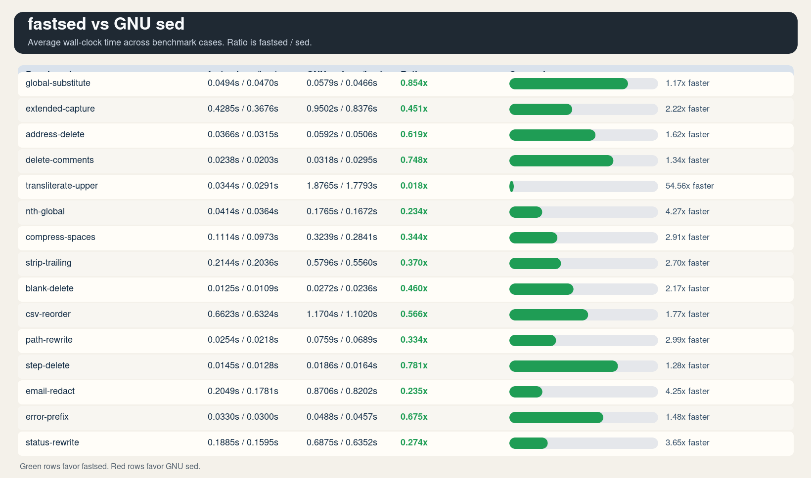
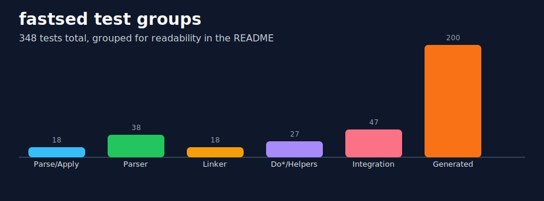

# fastsed

A fast, feature-complete `sed(1)` clone written in C++23.

Supports the full POSIX command set plus GNU sed extensions: `e F Q R T W z`
step addresses (`first~step`), `s///` flags `i g e nth`, `\l \u \L \U \E` in
replacements, and `--sandbox` mode.

## Layout

```
fastsed/
  Include/fastsed/     Production headers (one per module)
  Source/              Production sources + Main.cpp
  Benchmark/
    Scripts/           sed programs used by the benchmark harness
    run.sh             compares the selected build output against system sed
  Test/
    Include/           Test-only headers (TestHelper.hpp)
    Source/            GoogleTest suites (one per module + integration)
  ~/External/googletest/ GoogleTest checkout used by the build
  Bin/ or .fastsed-build/  Build artefacts (CMake intermediate + binaries)
    fastsed            Main binary
    Tests/
      fastsed_tests    Test binary
  b                    Build script
  rt                   Test runner
  CMakeLists.txt
```

## Quick start

```bash
./b          # configure + build (Release)
./b Debug    # debug build
./install.sh --prefix "$HOME/.local"

./rt         # build then run all 148 tests
./rt --rebuild           # wipe the selected build dir, full rebuild, then run tests
./rt --filter Integration # run only tests matching a pattern
./rt --repeat 5          # run the suite 5 times
./rt --verbose           # print per-test timing

./Benchmark/run.sh       # compare fastsed against /usr/bin/sed
./Benchmark/run.sh --runs 10 --warmup 3
./Benchmark/run.sh --png-out /tmp/fastsed-bench.png
```

Installation installs the executable as `fsed` and the manual page as `fsed(1)`.
By default it installs to `~/.local` for normal users and `/usr/local` for
root, unless `--prefix` is set explicitly.
If `Bin/` is not writable, the build scripts fall back to `.fastsed-build/`
automatically.
The build expects GoogleTest at `~/External/googletest` by default and will clone it there on first use.

## Benchmarks

The latest benchmark run is versioned in `Benchmark/Results/`:

- `latest_results.csv`
- `latest_results.svg`
- `latest_results.png`



Regenerate it with:

```bash
./Benchmark/run.sh --runs 10 --warmup 3
```

## Examples

```bash
# Basic substitution
echo 'alpha beta' | ./Bin/fastsed 's/beta/gamma/'

# Print only matching lines
./Bin/fastsed -n '/error/p' app.log

# Edit a file in place and keep a backup
./Bin/fastsed -i.bak 's/localhost/db.internal/g' config.ini

# Use extended regex syntax
printf 'cat\ncot\ncut\n' | ./Bin/fastsed -E '/c(a|o)t/p'

# Apply multiple commands
printf 'a\nb\nc\n' | ./Bin/fastsed -e '1d' -e '$a done'

# Run a script from a file
./Bin/fastsed -f scripts/cleanup.sed input.txt

# Replace only every second match on each line
echo 'one two two two' | ./Bin/fastsed 's/two/TWO/2g'

# Step addresses (GNU extension): print every third line starting at line 2
seq 10 | ./Bin/fastsed -n '2~3p'

# Treat NUL as the line delimiter
printf 'a\0b\0c\0' | ./Bin/fastsed -z 's/b/B/'

# Sandbox mode disables commands that touch the shell or filesystem
./Bin/fastsed --sandbox -f script.sed input.txt
```

Notes:
`--sandbox` rejects `e`, `r`, `R`, `w`, and `W` commands.
`-s` processes each input file as its own stream, while plain multi-file input is treated as one continuous stream.

## Architecture

| Header | Responsibility |
|---|---|
| `OutBuf.hpp` | 64 KiB buffered writer — avoids per-line `write()` syscall |
| `Regex.hpp` | POSIX `regcomp`/`regexec` wrapper — compiled once, matched many |
| `Replacement.hpp` | Pre-parsed `s///` replacement token list |
| `Address.hpp` | Address kinds: line, `$`, `/re/`, `first~step` |
| `Command.hpp` | Parse tree (`Cmd`/`CmdVec`) and flat IR (`FlatCmd`) |
| `Parser.hpp` | Recursive-descent sed script parser |
| `Linker.hpp` | Flattens parse tree to `FlatCmd[]`, resolves label jumps |
| `Engine.hpp` | PC-based execution loop, hold space, deferred output |
| `LineSource.hpp` | `Boost.Iostreams` `mapped_file_source` + stdin lookahead |
| `Options.hpp` | `Boost.Program_options` CLI parser |

The engine never recurses into nested `{…}` blocks at runtime. The linker
converts them to a flat array with pre-computed jump indices, so `b`/`t`/`T`
and block entry/exit are O(1) branches.

## Boost components

| Component | Used for |
|---|---|
| `Boost.Iostreams` `mapped_file_source` | Zero-copy mmap of input files |
| `Boost.Program_options` | `--expression`, `--file`, `--sandbox`, `-i`, etc. |
| `Boost.Filesystem` | Temp file paths for in-place (`-i`) editing |
| `Boost.Process` | `exec_shell()` for the `e` command (replaces `popen`) |

POSIX `regcomp`/`regexec` is used instead of `Boost.Regex` — it is
measurably faster for the short patterns typical in sed scripts.

## Building on Windows

```powershell
cmake -B Bin `
      -DBOOST_ROOT="D:/boost/boost_1_91_0" `
      -DBOOST_LIBRARYDIR="D:/boost/boost_1_91_0/stage/lib" `
      -DCMAKE_BUILD_TYPE=Release
cmake --build Bin
```

## Tests

348 GoogleTest cases across six suites:



| Suite | Tests | Covers |
|---|---|---|
| `ParseRepl` / `ApplyRepl` | 18 | Replacement token parsing, case conversion, back-refs |
| `Parser` | 38 | Every address type, command, flag, block, negation |
| `Linker` | 18 | Flatten, jump targets, label resolution, death tests |
| `DoTrans` / `DoList` / `DoSubst` | 27 | `y`, `l`, `s` helpers with all flag combos |
| `Integration` | 47 | End-to-end via `run_sed()` in `Test/Include/TestHelper.hpp` |
| `Generated` | 200 | Parameterized regression sweep across substitution, deletion, transliteration, and line numbering |

`TestHelper.hpp` redirects `g_out` to a pipe and feeds input via a
`mkstemp` temp file, so each test is fully isolated with no global state
leakage.
